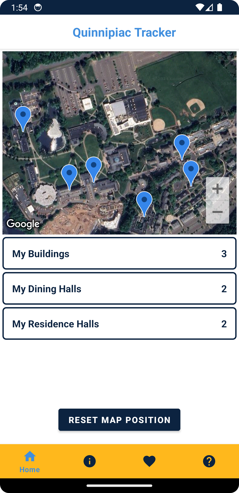
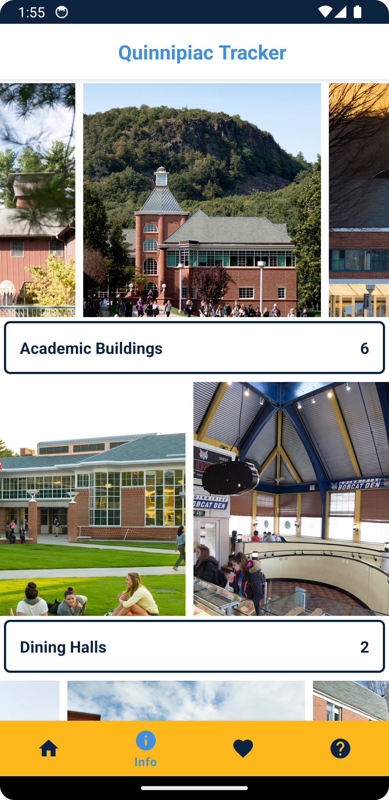
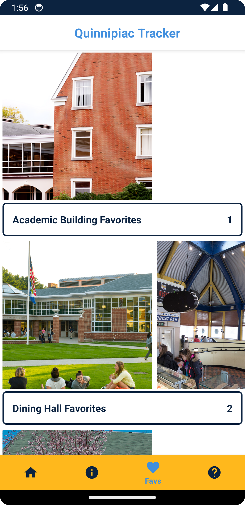

# Quinnipiac Tracker

An Android app for information and location journaling at Quinnipiac University. The final project for the SER210 Android development class.

## Screenshots

<div style="margin-bottom: 20px; display: flex; flex-wrap: wrap;">
  
  
  
  
  <br>
  <small>‎ ‎ ‎ ‎ ‎ ‎ Home Screen</small>
  <small>‎ ‎ ‎ ‎ ‎ ‎ ‎ ‎ ‎ ‎ ‎ ‎ ‎ ‎ Info Screen</small>
  <small>‎ ‎ ‎ ‎ ‎ ‎ ‎ ‎ ‎ ‎ ‎ ‎ ‎ Favs Screen</small>
  <small>‎ ‎ ‎ ‎ ‎ ‎ ‎ ‎ ‎ ‎ ‎ ‎ Help Screen</small>
</div>

## Getting Started

### Android App Store

Upon the final updates to the first version of the app, we will be publishing QuinnipiacTracker to the Android App Store. Stay tuned for updates!

### Source Code

If you want to work with the source code instead, clone this repository to your local machine:

```bash
git clone https://github.com/bajackson1/QuinnipiacTracker.git
```

Open the folder in Android Studio, build it, and run it on an emulator or a physical device.

#### Prerequisites

- Android Studio
- Android SDK
- An Android emulator or a physical Android device

## Usage

Upon launching the app, users will be greeted with the home screen where they will see the map of the Quinnipiac Campus and can navigate to the building information, favorite buildings, and help all from the action bar at the bottom of the screen.

## [Documentation](https://bajackson1.github.io/documentation)

You can find the documentation for this project and all of my other collaborative school projects at the website above.

## API Usage

For the map display and entering in specific locations unique to Quinnipiac's campus, we used the [Maps SDK for Android](https://console.cloud.google.com/apis/library/maps-android-backend.googleapis.com?project=quinnipiactracker&supportedpurview=project). This is a Google Cloud API that is free to use with a Google account and has easy Kotlin integration for any Android app. In fact, this is what the "Google Maps Project" template in Android Studio uses. The documentation for setting it up can be found [here](https://developers.google.com/maps/documentation/android-sdk/start#android_mapsactivity-java).

## Inspiration

The inspiration for this app is [been](https://apps.apple.com/pl/app/been/id680148327). This is a wonderful app in which the user can track their countries, states, and cities visited around the world and it was the reason we wanted to make this app.

## Credits

This app was created by [Cole Davignon](https://github.com/cdavignon) and [Brooks Jackson](https://github.com/bjaxqq).
